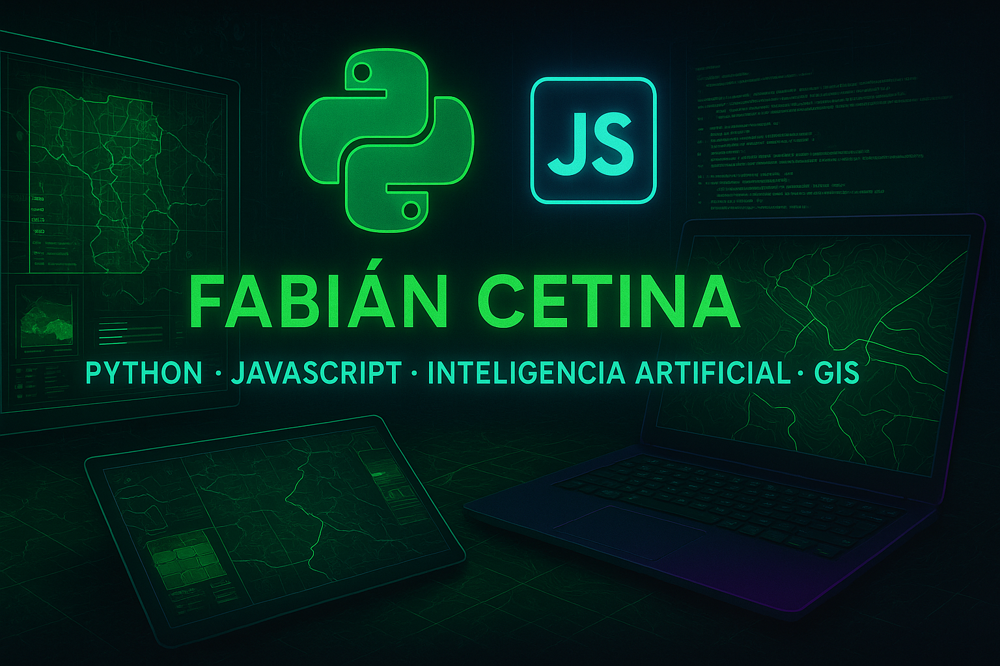

## Hi there 👋

# Fabián Cetina | Python Developer & GIS Specialist 🐍🌍🚀

  

## 🧠 Sobre mí

¡Hola! Soy un apasionado ingeniero de software y entusiasta GIS con cerca de 10 años explorando el fascinante mundo de las tecnologías geoespaciales. Actualmente tengo la suerte de colaborar con el equipo de Esri Colombia, donde aprendo cada día algo nuevo sobre sistemas de información geográfica.

Trabajo principalmente con Python y JavaScript, creando aplicaciones web y APIs RESTful que conectan diferentes sistemas. Me encanta la idea de combinar el desarrollo de software con el análisis geoespacial para crear soluciones innovadoras.

He tenido la oportunidad de trabajar en proyectos que van desde la visualización de datos geoespaciales hasta la integración de herramientas de inteligencia artificial en aplicaciones cotidianas. Me gusta mantenerme al día con las últimas tendencias y tecnologías, y siempre estoy buscando formas de mejorar mis habilidades y conocimientos.

Mi mayor motivación es crear soluciones que realmente resuelvan problemas, combinando lo mejor de los mundos geoespacial y de desarrollo para construir herramientas útiles, eficientes y accesibles. Siempre estoy abierto a aprender y colaborar en nuevos proyectos.

  

## 💻 Tecnologías & Herramientas

## 🔍 Mis intereses y áreas de trabajo

- 🐍 Desarrollo con Python, mi lenguaje favorito
- 🌐 Creación de APIs RESTful que conectan servicios
- 📊 Visualización y análisis de datos para contar historias
- 🗺️ Exploración del mundo a través de GIS
- 🌍 Trabajo con la plataforma ArcGIS y el ecosistema Esri
- 🧩 Conexión de diferentes sistemas para que trabajen juntos
- 🧠 Experimentación con servidores MCP (Model-Context-Protocol)
- 🤖 Integración de herramientas de IA en aplicaciones cotidianas
- 📦 Implementación de soluciones con Docker para facilitar despliegues
- 💻 Desarrollo web colaborativo con React, Node.js y Django
- 🛠️ Automatización de procesos con GitHub Actions y Azure DevOps

## 🌱 Lo que estoy aprendiendo ahora

- Conectando GitHub Copilot con servidores MCP
- Aplicando Machine Learning a problemas reales de desarrollo
- Explorando nuevos horizontes en IA aplicada
- Mejorando la calidad de mis APIs
- Haciendo aplicaciones web más rápidas y eficientes
- Aventurándome en el mundo de Kubernetes
- Migrando soluciones a la nube (AWS, Azure)
- Adoptando las mejores prácticas de la comunidad
- Optimizando flujos de trabajo con CI/CD

## 👯 Me encantaría colaborar en

- Proyectos open source que hagan del mundo un lugar mejor
- Herramientas que faciliten el día a día de los desarrolladores
- Iniciativas educativas que acerquen la tecnología a más personas

#### Puedes apoyar mi trabajo haciendo "☆ Star" en el repositorio o nominarme a "GitHub Star". ¡Gracias!

## 📫 Contáctame

- 📧 Email: [ingfcetina@gmail.com](mailto:ingfcetina@gmail.com)
- 🔗 LinkedIn: [Fabián Cetina](https://www.linkedin.com/in/fabian-cetina-pythondev/)

## 📊 Estadísticas de contribución

  

  

---

  
  ### Contador de visitas
  
  

